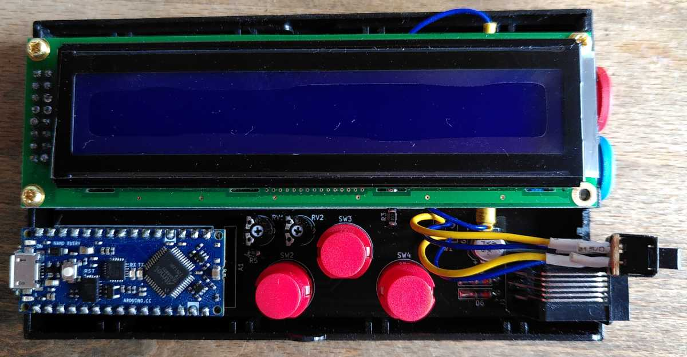
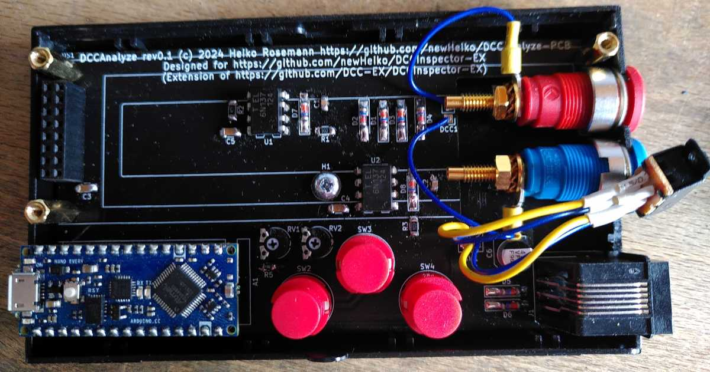
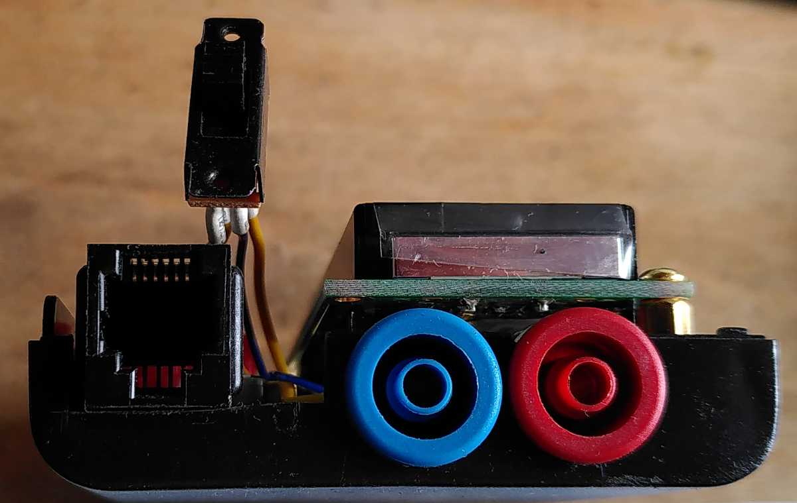
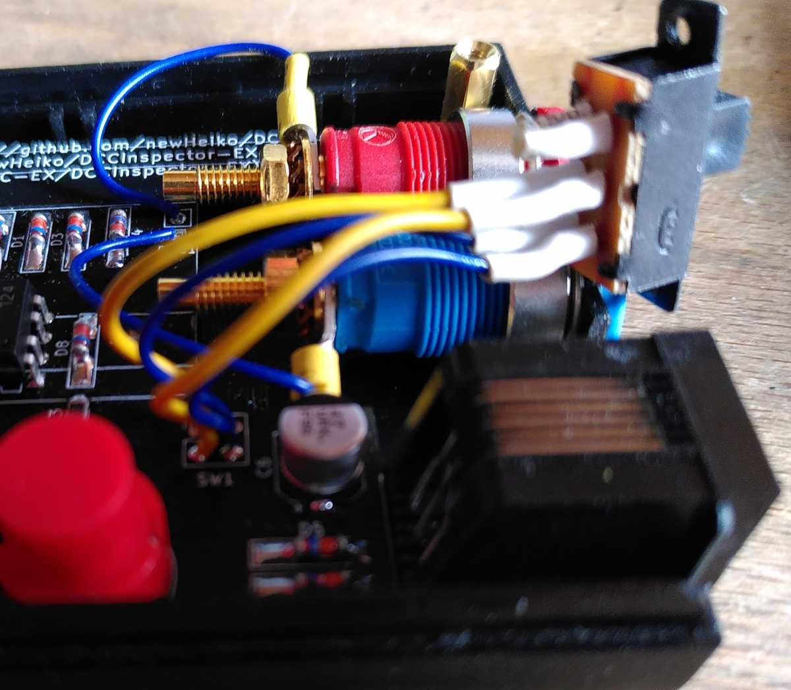

= DCCAnalyze hardware

This repo contains the PCB files for a stand-alone DCC analyzer.

== DCCAnalyze firmware

The firmware can be found at [newHeiko/DCCInspector-EX](https://github.com/newHeiko/DCCInspector-EX) which is an extension of [DCC-EX/DCCInspector-EX] (https://github.com/DCC-EX/DCCInspector-EX) by the following points (some tbd).

- [x] Add support for Arduino Nano Every
- [] Add support for keys
- [] Add support for LCD

== Building DCCAnalyze hardware

The PCB was created with kicad 8.0, the production files with the Fabrication Toolkit.

Most of the parts are from my box of spare and leftover parts, which is why I mixed different size SMD parts, some also rather unusual.

This is the full partlist:
| Parts | Value | Notes / Source |
| ----- | ----- | -------------- |
| A1    | Arduino Nano Every | [Reichelt](https://www.reichelt.de/arduino-nano-every-atmega4809-ohne-header-ard-nano-eve-p261300.html?&nbc=1) |
| C1, C2 | 1nF  | 0805  |
| C3, C4, C5 | 100nF | 1206 |
| C6    | 47µF  | Dia 6.3mm, min 25V |
| D1, D2, D3, D4, D5, D6, D7, D8 | BAT42 | MiniMELF |
| J1 | RJ12-connector | [Reichelt](https://www.reichelt.de/modular-einbaubuchse-6-6-schwarz-mebp-6-6s-p11370.html?&nbc=1) |
| R1, R3 | 1kOhm | 1206 |
| R2 | 470Ohm | 1206 |
| R5 | 47Ohm | 0805 |
| RV1 | 500 Ohm | Piher PT-6 [Reichelt](https://www.reichelt.de/einstellpotentiometer-liegend-500-ohm-6-mm-pt-6-l-500-p14989.html?&nbc=1) |
| RV2 | 10kOhm | Piher PT-6 [Reichelt](https://www.reichelt.de/einstellpotentiometer-liegend-10-kohm-6-mm-pt-6-l-10k-p14982.html?&nbc=1) |
| SW2, SW3, SW4 | Digitast DT6 | [Reichelt](https://www.reichelt.de/eingabetaster-schaltspannung-100v-rund-sw-dt-6-sw-p7241.html?&nbc=1) |
| U1, U2 | 6N137 | DIP8 |
| LCD | 24x2 | [Reichelt](https://www.reichelt.de/lcd-modul-2x24-h-5-6mm-bl-ws-m-bel--lcd-242a-bl-p53951.html?&nbc=1) |
| SW1 | DPST or DPDT | [Reichelt](https://www.reichelt.de/schiebeschalter-miniatur-loetanschluss-2x-um-sw-t-217-p19976.html?&nbc=1) |
| DCC | 2x SKS SEB 2610 F4,8 | 2x [Reichelt](https://www.reichelt.de/einbaubuchse-4-mm-faston-gelb-gesichert-seb-2610f-ge-p106132.html?&nbc=1) |
| PinHeader for A1 | 2x 1x16 | 2x [Reichelt](https://www.reichelt.de/stiftleisten-2-54-mm-1x16-gerade-mpe-087-1-016-p119887.html?&nbc=1) |
| Socket for A1    | 2x 1x16 | 2x [Reichelt](https://www.reichelt.de/buchsenleisten-2-54-mm-1x16-gerade-mpe-094-1-016-p119919.html?&nbc=1) |
| PinHeader for LCD | 2x8 | [Reichelt](https://www.reichelt.de/stiftleisten-2-54-mm-2x08-gerade-mpe-087-2-016-p119897.html?&nbc=1) |
| Socket for LCD    | 2x8 | [Reichelt](https://www.reichelt.de/buchsenleiste-2x8-pol-vergoldet-2-54-bkl-10120808-p235674.html?&nbc=1) |
| 3x LCD stand-offs | 3x M2.5 x 12mm | |
| LCD screws | 6x M2.5 x 6mm | |
| PCB screw | 1x Dia 2.9mm x 6.5mm | |
| Enclosure | | 2x [Reichelt](https://www.reichelt.de/kunststoff-halbschale-123-x-70-x-14-5-mm-sd-10-gr-halb-p149274.html?&nbc=1) |

The device can decode the DCC signal either from the loconet(r) plug and its Railsync signal or from the two 4mm sockets. The sockets included in the BOM above are shorter than the ones I used for my prototype - they should fit in the recess of the PCB.

Power can come from the USB connection (then the DCC inputs both are optically isolated from everything else) or from the DCC / Railsync signal (then the USB connection is not required and the device can be used stand-alone).

The switch SW1 switches the device power from USB to DCC/Railsync.

Note that for the switch, the polarity matters. In the image above, the lower yellow wire needs to connect to the lower blue wire and the upper yellow wire to the upper blue wire.

You may substitute a classic Arduino Nano for the Arduino Nano Every, but the integrated linear voltage regulator of the classic Arduino Nano will probably get very hot. Beware of DCC / Railsync input voltages above ~12V or so in that case.
